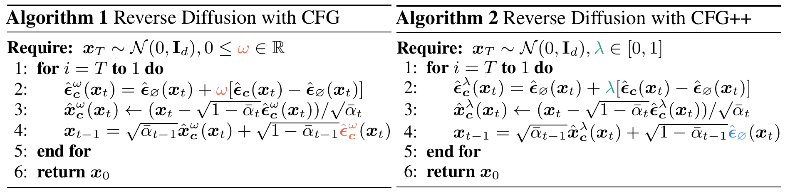
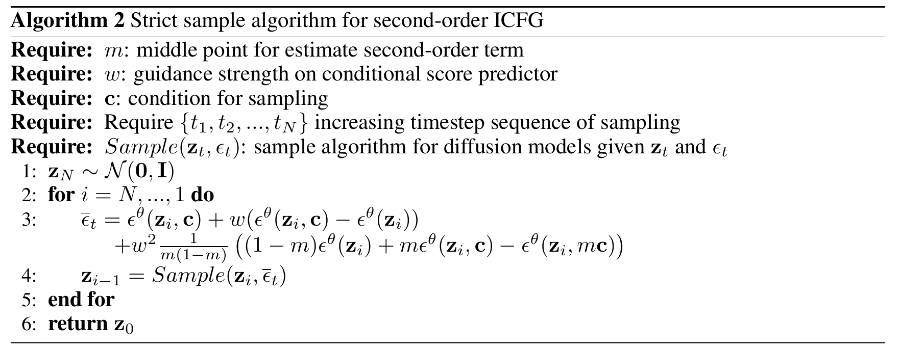

# A Summary of Classifier-Free Guidance and its Improvements

Classifier-Free Guidance (CFG) is widely used in the field of image generation to improve the quality and diversity of generated images by enhancing the conditioning of the model. The article first introduces the background of CFG, including diffusion model, classifier guidance and CFG. Then, it summarizes the improvements of CFG to deal with the limitations of CFG.

## Background

### Diffusion Model

Diffusion models are widely used in the field of image generation inspired by a physical process called non-equilibrium thermodynamics. Given data $x_0\sim q(x)$, where $q(x)$ is the data distribution, the diffusion model aims to learn a denoising process $p_\theta(x_{0:T}\mid x_T)$ to generate data from noise. Diffusion model can be divided into two processes: forward process and denoising process. During the forward process, the model samples the data distribution $q(x_t\mid x_{t-1})$ to generate data from noise. During the reverse process, the model learns the reverse process $p_\theta(x_{t-1}\mid x_t)$ to generate data from noise, where $x_t$ refers to the data at time step $t$ corresponding to the noise level at time step $t$. Using DDPM [1] as an example, the forward process is defined as:

$$
q(x_t\mid x_{t-1})=\mathcal{N}(x_t;\sqrt{1-\beta_t}x_{t-1},\beta_t\mathbf{I}) \tag{1}
$$

where $\beta_t$ is a hyperparameter. We can calculate the $q(x_t\mid x_0)$ by recursively applying the forward process:

$$
q(x_t\mid x_0)=\mathcal{N}(x_t;\sqrt{\bar\alpha_t}x_0,(1-\bar\alpha_t)\mathbf{I}) \tag{2}
$$

where $\bar{\alpha_t}=\prod_{i=1}^{t}(1-\beta_i)$. Using reparametrization trick, we can sample $x_t$ from $q(x_t\mid x_0)$ as:

$$
x_t=\sqrt{\bar{\alpha}_t}x_0+\sqrt{1-\bar{\alpha}_t}\epsilon_t \tag{3}
$$

where $\epsilon_t\sim\mathcal{N}(\mathbf{0},\mathbf{I})$.

During the denoising process, the model predicts the distribution of $x_0$ from $x_t$ and $t$. Suppose the model is trained to predict the distribution of $x_0$ as $p_\theta(x_0\mid x_t)$.

For DDPM, the model tries to predict the added noise $\epsilon_t$ from $x_t$ and $x_0$. Suppose the model is trained to predict the noise $\epsilon_\theta(x_t,t)$, the training objective is to minimize the following loss:

$$
\mathbb{E}_{x_0\sim q(x_0),t\sim[1,T]}[\| \epsilon_\theta(x_t,t)-\epsilon_t\| ^2] \tag{4}
$$

During the generation process, the model samples the data distribution $q(x_t\mid x_{t-1})$ to generate data from noise. The score (predicted noise) $\epsilon_\theta(x_t,t)$ is used to guide the generation process. The relationship between score and predicted noise is given by:

$$
\epsilon_\theta(x_t,t)=-\sigma_t\nabla_x\log p(x_t) \tag{5}
$$
 
To generate conditional data, the model is trained to sample the conditional data distribution $q(x\mid c)$, where $c$ is the condition, and the training objective is to predict the conditional score $s(x,t,c)=\nabla_x\log q(x\mid c)$, where $t$ is the time step determining the noise level. 
However, during the practical application, the performance of predicting the conditional score is not good enough, leading to images with low quality and low diversity. To deal with this problem, guidance methods, such as classifier-free guidance and its former method classifier guidance, are proposed to improve the quality of generated conditional images. Classifier guidance is firstly introduced, and then classifier-free guidance is discussed. 


### Classifier Guidance

At first, diffusion models are trained without any conditions or labels. To generate images belonging to specific classes, Dhariwal P et al. [2] propose classifier guidance to guide the model to generate images with specific classes.
The core idea of classifier guidance is guiding the generation process by adding the gradient of the log-probability of the class conditional to the noise prediction. The score $\epsilon_\theta(x_t,t,c)=-\sigma_t\nabla_x\log p(x_t\mid c)$ is changed to be:

$$
\tilde\epsilon_\theta(x_t,t,c)=\epsilon_\theta(x_t,t,c)-\lambda\sigma_t\nabla_{x_t}\log p_\phi(c\mid x_t) \approx -\sigma_t\nabla_{x_t}(\log p(x_t\mid c)+\lambda\log p_\phi(c\mid x_t)) \tag{6}
$$

Here $\phi$ is an classifier trained to predict the class conditional probability $p_\phi(c\mid x_t)$ and $\lambda$ is a hyperparameter to control the strength of the guidance. It results in the distribution $\tilde{p}(x_t\mid c)= p(x_t\mid c)p_{\phi}(c\mid x_t)^\lambda$. It can be seen that $p_{\phi}(c\mid x_t)$ increases the probability of the generated image belonging to the class $c$ and $\lambda$ controls the strength of the guidance. Classifier guidance can be applied to both pretrained no-condtional and conditional diffusion models. For conditional diffusion models, classifier guidance can be used to enhance the condition of the generation process to obtain better conditional images.

## Classifier-Free Guidance

Inspired by classifier guidance, Ho J et al. [1] proposes classifier-free guidance (CFG) to improve the quality of generated images. Classifier-free guidance proposes to use conditional and unconditional score to guide the generation process by using the linear combination of these two scores, which can be formulated as:

$$
\tilde{\epsilon}_\theta(x_t,t,c)= \epsilon_\theta(x_t,t,c)+ \lambda(\epsilon_\theta(x_t,t,c)-\epsilon_\theta(x_t,t)) \tag{7}
$$

where $\epsilon_\theta(x_t,t)$ is the score of the unconditional diffusion model.

If we see the relationship between the gradient of the log-probability and the score, we can find that:

$$
\nabla_x\log p(c\mid x_t)= -\frac{1}{\sigma_t}(\epsilon_\theta(x_t,t,c)-\epsilon_\theta(x_t,t)) \tag{8}
$$

Here we use the Bayes' rule $p(c\mid x_t) \propto p(x_t\mid c)/p(x_t)$ and the score prediction equation, which satisfies $\nabla_x\log p(x_t\mid c)=-\frac{1}{\sigma_t}\epsilon_\theta(x_t,t,c)$ and $\nabla_x\log p(x_t)=-\frac{1}{\sigma_t}\epsilon_\theta(x_t,t)$. In this way, classifier-free guidance replaces the classifier in classifier guidance with the difference between the conditional and unconditional score. Therefore, classifier-free guidance do not need to train a classifier and the diffusion model itself can be used to generate better conditional images.

## Improvements of Classifier-Free Guidance

Despite the success of classifier-free guidance in generating high-quality conditional images, it still has some limitations. 
First, CFG may lead to distribution that is impossible to be generated by the denoising process. Second, CFG may cause over-enhancement of the condition $c$, leading to oversaturated images.
In this section, we will discuss some improvements of classifier-free guidance.

### Classifier-Free Guidance is a Predictor-Corrector [3]

It can be seen that CFG uses Equation (7) to sharpen the distribution of given condition to be a gamma-powered distribution: $\tilde{p}(x_t\mid c)= p(x_t)^{1-\lambda}p(x_t\mid c)^\lambda$. However, there is a problem in the diffusion forward process that CFG scores might not be a valid score. In the paper [3], authors put forward that $\tilde{p}(x_t\mid c)$ is not the same as the distribution
obtained by applying a forward diffusion process to the gamma-powered data distribution $\tilde{p}(x_0\mid c)$. Using $N_t[p]$ to denote the diffusion forward process from $t=0$ to $t=t$, 

$$
\tilde{p}(x_t\mid c)=N_t[{p}(x\mid c)]^{\lambda}N_t[p(x)]^{1-\lambda} \neq N_t[p(x_0\mid c)^\lambda p(x_0)^{1-\lambda}] \tag{9}
$$

The distribution of $\tilde{p}(x_t\mid c)$ is not corresponding to any trained forward process, making the predicted score not valid. To solve the problem, the authors propose a method called predictor-corrector guidance (PCG), which combines diffusion denoising process and Langevin dynamics steps to correct the CFG predicted score belonging to a unknown distribution. 

The algorithm can be summarized as follows: At timestep $t$,
1. Predictor: Take diffusion denoising process to predict the score $\epsilon_\theta(x_t,t,c)$ to move to time $t'=t-\Delta t$
2. Corrector: Take Langevin dynamics steps to correct the score: 
$$
 \tilde\epsilon_\theta(x_t,t',c)=\epsilon_\theta(x_{t'},t',c)+\lambda(\epsilon_\theta(x_{t'},t',c)-\epsilon_\theta(x_{t'},t')) \tag{10}
$$

It might take several Langevin dynamics steps to converge to the correct score. If we compare PCG with CFG, PCG aims to make a correction to the CFG predicted score to make it valid after the diffusion denoising process from time $t$ to $t'$.

### CFG++: Manifold-constrained Classifier Free Guidance for Diffusion Models [4]

In the paper "Classifier-Free Guidance is a Predictor-Corrector", the authors make a correction of CFG score after the diffusion denoising process. We may wonder whether it is possible to make a correction to the CFG score before the diffusion denoising process. In the paper "CFG++: Manifold-constrained Classifier Free Guidance for Diffusion Models", the authors propose a method called CFG++, which makes a correction to the CFG score before the diffusion denoising process. 

The algorithm can be summarized as follows:


Compared with CFG, CFG++ makes a correction of the CFG score at the diffusion denoising process. The authors treat the solution of CFG score as a diffusion model-based inverse problem and make the loss function to be a text-conditioned score matching loss.

$$
\min_{x\sim q(x)}\| \epsilon_\theta(\sqrt{\bar{\alpha}_t}x+\sqrt{1-\bar{\alpha}_t}\epsilon,t,c)-\epsilon\| ^2 \tag{11}
$$

where $\epsilon$ is the noise sampled from the Gaussian distribution.

### Rectified Diffusion Guidance for Conditional Generation [5]

In the paper "Rectified Diffusion Guidance for Conditional Generation", the authors propose a method called ReCFG. Different from CFG, ReCFG change the guidance coefficient $\lambda$ to be a function of the condition $c$. ReCFG changes the CFG score to be:

$$
\tilde{\epsilon}_\theta(x_t,t,c)=\lambda_1\epsilon_\theta(x_t,t,c)+\lambda_2\epsilon_\theta(x_t,t) \tag{12}
$$

The authors prove that there is a relationship between $\lambda_1$ and $\lambda_2$ so we just need to known $\lambda_1$, then predict $\lambda_1$ as a function of the condition $c$.

### Guiding a Diffusion Model with a Bad Version of Itself [6]

In the paper "Guiding a Diffusion Model with a Bad Version of Itself", the authors propose that the unconditional score can be changed to be a predicted conditional score of a bad version of the diffusion model. The CFG score is changed to be:

$$
\tilde{\epsilon}_\theta(x_t,t,c)=\epsilon_\theta(x_t,t,c)+\lambda(\epsilon_\theta(x_t,t,c)-\epsilon_{\theta^{'}}(x_t,t,c)) \tag{13}
$$

where $\theta^{'}$ is a bad version of the diffusion model $\theta$ (The bad version may be trained with fewer training steps). It can also sharpen the distribution of the condition $c$ by using the difference of conditional score between the bad version and the good version.

### Self-Guidance: Boosting Flow and Diffusion Generation on Their Own [7]

CFG enhances the condition $c$ by using the difference between the conditional and unconditional score. In the paper "Self-Guidance: Boosting FLow and Diffusion Generation on Their Own", the authors propose to use the conditional score in time $t+\Delta t$ to replace the unconditional score in time $t$ to enhance the condition $c$. The core idea of Self-Guidance is that the distribution $p(x_t,t+\Delta t,c)$ is smoother than the distribution $p(x_t,t,c)$. Therefore, the CFG score is modified to be:

$$
\tilde{\epsilon}_\theta(x_t,t,c)=\epsilon_\theta(x_t,t,c)+\lambda(\epsilon_\theta(x_t,t,c)-\epsilon_\theta(x_t,t+\Delta t,c)) \tag{14}
$$

It can also sharpen the distribution of the condition $c$ by using a more noise-like score at time $t+\Delta t$ to replace the unconditional score at time $t$. Moreover, it does not require the condition $c$ and seems to work well without any condition.

### Applying Guidance in a Limited Interval Improves Sample and Distribution Quality in Diffusion Models [8]

In the paper "Applying Guidance in a Limited Interval Improves Sample and Distribution Quality in Diffusion Models", the authors propose to limit the range of CFG process, which may be uncessary during the beginning of the denoising process (high noise level) and the end of the denoising process (low noise level).

### Analysis of Classifier-Free Guidance Weight Schedulers [9]

In the paper "Analysis of Classifier-Free Guidance Weight Schedulers", the authors propose to set changed $\lambda$ in different time steps to improve the quality of generated images. Here $\lambda$ is a function related to timestep $t$. The authors test different kinds of $\lambda$ functions and find that linear function is a good choice.

### Inner Classifier-Free Guidance and Its Taylor Expansion for Diffusion Models [10]

In the paper "Inner Classifier-Free Guidance and Its Taylor Expansion for Diffusion Models", the authors prove that CFG is a first-order approximation of the inner conditional guidance and expand CFG to be a second-order approximation of the inner conditional guidance. The algorithm can be summarized as follows:



## References

[1] Ho J, Jain A, Abbeel P. Denoising Diffusion Implicit Models. In: Advances in Neural Information Processing Systems. 2022. 

[2] Dhariwal P, Nichol A. Diffusion Models Beat GANs on Image Synthesis. In: Advances in Neural Information Processing Systems. 2021. 

[3] Arwen B, Preetum N. Classifier-Free Guidance is a Predictor-Corrector. arXiv preprint arXiv:2408.00090, 2024. 

[4] Chung H, Kim J, Park G Y, et al. Cfg++: Manifold-constrained classifier free guidance for diffusion models. arXiv preprint arXiv:2406.08070, 2024.

[5] Xia M, Xue N, Shen Y, et al. Rectified Diffusion Guidance for Conditional Generation. arXiv preprint arXiv:2410.18737, 2024.

[6] Karras T, Aittala M, Kynkäänniemi T, et al. Guiding a Diffusion Model with a Bad Version of Itself. arXiv preprint arXiv:2406.02507, 2024.

[7] Li T, Luo W, Chen Z, et al. Self-Guidance: Boosting Flow and Diffusion Generation on Their Own. arXiv preprint arXiv:2412.05827, 2024.

[8] Kynkäänniemi T, Aittala M, Karras T, et al. Applying guidance in a limited interval improves sample and distribution quality in diffusion models. arXiv preprint arXiv:2404.07724, 2024.

[9] Wang X, Dufour N, Andreou N, et al. Analysis of Classifier-Free Guidance Weight Schedulers. arXiv preprint arXiv:2404.13040, 2024.

[10] Sun S, Wei L, Wang Z, et al. Inner classifier-free guidance and its taylor expansion for diffusion models. In: The Twelfth International Conference on Learning Representations. 2023.

## Citation

If you want to cite this article, you can use the following BibTeX:

```
@article{CFG_en,
  title={A Summary of Classifier-Free Guidance and its Improvements},
  author={Jiadong Pan},
  year={2025},
  month={January},
  url={\url{https://matrix0721.github.io/2025/01/21/a-summary-of-classifier-free-guidance-and-its-improvements.html}}
}
```
